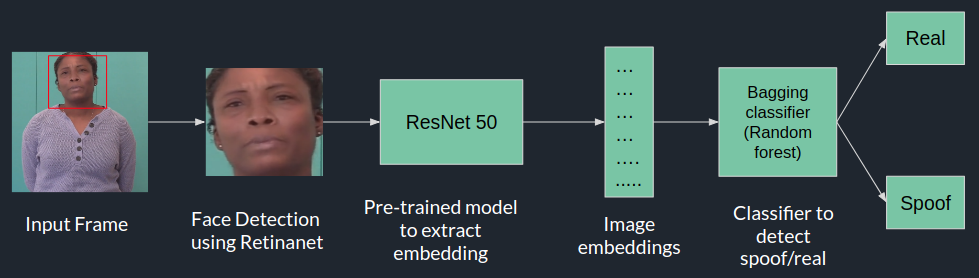

## Spoof_Detection
This repository contains spoof detection code where Bagging classifer (Random Forest) is used along with ResNet50 to achieve 91.78% accuracy while detecting spoof on our test data.
#### Demo video : <a href="https://www.youtube.com/watch?v=G3gV-1NH5uk&feature=youtu.be&fbclid=IwAR1yE04NHubkDBMy7dCIHV7HOemzmA-HYkt4Jzw6A5826FY99-Wui0raLyI">Project demo</a>
## Dependencies
1. This project is tested on CPU Core i5 (6th Gen), 8 GB RAM
2. Keras 2.3.1
3. Tensorflow 1.13.1
4. Opencv 3.4.2
5. Numpy 1.16.4
6. Pandas 0.23.4
7. Scikit-learn 0.21.2
## project Pipeline

